# HOT-DORS — StateFlow Report

Generated: 2025-08-23T18:36:18.569Z

## Summary

- Atoms: 0
- Duplicates: 0
- Bridge: FOUND
  - Emits: STAGE_CHANGE, STAGE_CHANGED, BUILD_EMERGENCE_BLUEPRINT, BUILD_BLUEPRINT, MORPH_PROGRESS, QUALITY_CHANGE
- Engine/WebGL listeners: 2

### Invariants

- Bridge exists: **PASS**
- Bridge emits MORPH_PROGRESS: **PASS**
- Bridge emits STAGE_CHANGED/BUILD_BLUEPRINT: **PASS**
- Engine listens MORPH_PROGRESS: **PASS**
- Engine listens STAGE_CHANGED/BUILD_BLUEPRINT: **PASS**

## Mermaid — State Flow

```mermaid
flowchart TD
B_BRIDGE["AtomicToBeatBus\nmodules/state/bridges/AtomicToBeatBus.js"]
B_BUS[("BeatBus")]
L_src_canon_guard_runtime_GuardRuntimeInject_js["src/canon-guard/runtime/GuardRuntimeInject.js"]
L_src_components_consciousness_ConsciousnessTheater_jsx["src/components/consciousness/ConsciousnessTheater.jsx"]
L_src_components_theater_OpeningSequence_jsx["src/components/theater/OpeningSequence.jsx"]
L_src_components_webgl_WebGLBackground_jsx["src/components/webgl/WebGLBackground.jsx\n(uniform morphProgress)"]
L_src_dev_BlueprintTap_js["src/dev/BlueprintTap.js"]
L_src_engine_ConsciousnessEngine_js["src/engine/ConsciousnessEngine.js\n(uniform morphProgress)"]
B_BRIDGE -- "STAGE_CHANGE" --> B_BUS
B_BRIDGE -- "STAGE_CHANGED" --> B_BUS
B_BRIDGE -- "BUILD_EMERGENCE_BLUEPRINT" --> B_BUS
B_BRIDGE -- "BUILD_BLUEPRINT" --> B_BUS
B_BRIDGE -- "MORPH_PROGRESS" --> B_BUS
B_BRIDGE -- "QUALITY_CHANGE" --> B_BUS
E_src_canon_guard_L2_js["src/canon-guard/L2.js"]
E_src_canon_guard_L2_js -- "'STAGE_CHANGE'" --> B_BUS
E_src_canon_guard_L2_js -- "'QUALITY_CHANGE'" --> B_BUS
E_src_components_webgl_WebGLBackground_jsx["src/components/webgl/WebGLBackground.jsx"]
E_src_components_webgl_WebGLBackground_jsx -- "PARTICLES_EMERGED" --> B_BUS
E_src_engine_ConsciousnessEngine_js["src/engine/ConsciousnessEngine.js"]
E_src_engine_ConsciousnessEngine_js -- "PREWARM_COMPLETE" --> B_BUS
E_src_engine_ConsciousnessEngine_js -- "BLUEPRINT_READY" --> B_BUS
E_src_engine_ConsciousnessEngine_js -- "STAGE_CHANGE" --> B_BUS
E_src_engine_ConsciousnessEngine_js -- "BUILD_EMERGENCE_BLUEPRINT" --> B_BUS
E_src_engine_ConsciousnessEngine_js -- "QUALITY_CHANGE" --> B_BUS
E_src_theater_TheaterDirector_js["src/theater/TheaterDirector.js"]
E_src_theater_TheaterDirector_js -- "CURSOR_SHOW" --> B_BUS
E_src_theater_TheaterDirector_js -- "CURSOR_BLINK" --> B_BUS
E_src_theater_TheaterDirector_js -- "TERMINAL_TYPE" --> B_BUS
E_src_theater_TheaterDirector_js -- "AUDIO_KEY_CLICK" --> B_BUS
E_src_theater_TheaterDirector_js -- "SCREEN_FILL" --> B_BUS
E_src_theater_TheaterDirector_js -- "BUILD_EMERGENCE_BLUEPRINT" --> B_BUS
E_src_theater_TheaterDirector_js -- "PARTICLES_START_EMERGING" --> B_BUS
E_src_theater_TheaterDirector_js -- "AUDIO_START_STAGE" --> B_BUS
E_src_theater_TheaterDirector_js -- "START_NARRATIVE" --> B_BUS
E_src_theater_TheaterDirector_js -- "ENABLE_SCROLL" --> B_BUS
E_src_theater_TheaterDirector_js -- "PREWARM_GENESIS_BLUEPRINT" --> B_BUS
E_src_theater_TheaterDirector_js -- "AUDIO_COMPUTER_HUM" --> B_BUS
E_src_theater_TheaterDirector_js -- "DIRECTOR_CANCEL" --> B_BUS
B_BUS -- "BLUEPRINT_READY" --> L_src_canon_guard_runtime_GuardRuntimeInject_js
B_BUS -- "ENABLE_SCROLL" --> L_src_components_consciousness_ConsciousnessTheater_jsx
B_BUS -- "START_NARRATIVE" --> L_src_components_consciousness_ConsciousnessTheater_jsx
B_BUS -- "TRIGGER_FRAGMENT" --> L_src_components_consciousness_ConsciousnessTheater_jsx
B_BUS -- "CURSOR_SHOW" --> L_src_components_theater_OpeningSequence_jsx
B_BUS -- "CURSOR_BLINK" --> L_src_components_theater_OpeningSequence_jsx
B_BUS -- "TERMINAL_TYPE" --> L_src_components_theater_OpeningSequence_jsx
B_BUS -- "SCREEN_FILL" --> L_src_components_theater_OpeningSequence_jsx
B_BUS -- "AUDIO_COMPUTER_HUM" --> L_src_components_theater_OpeningSequence_jsx
B_BUS -- "AUDIO_KEY_CLICK" --> L_src_components_theater_OpeningSequence_jsx
B_BUS -- "PARTICLES_START_EMERGING" --> L_src_components_theater_OpeningSequence_jsx
B_BUS -- "DIRECTOR_CANCEL" --> L_src_components_theater_OpeningSequence_jsx
B_BUS -- "MORPH_PROGRESS" --> L_src_components_webgl_WebGLBackground_jsx
B_BUS -- "PARTICLES_START_EMERGING" --> L_src_components_webgl_WebGLBackground_jsx
B_BUS -- "BLUEPRINT_READY" --> L_src_components_webgl_WebGLBackground_jsx
B_BUS -- "'BLUEPRINT_READY'" --> L_src_dev_BlueprintTap_js
B_BUS -- "MORPH_PROGRESS" --> L_src_engine_ConsciousnessEngine_js
B_BUS -- "STAGE_CHANGE" --> L_src_engine_ConsciousnessEngine_js
B_BUS -- "QUALITY_CHANGE" --> L_src_engine_ConsciousnessEngine_js
B_BUS -- "PREWARM_GENESIS_BLUEPRINT" --> L_src_engine_ConsciousnessEngine_js
B_BUS -- "BUILD_EMERGENCE_BLUEPRINT" --> L_src_engine_ConsciousnessEngine_js
B_BUS -- "STAGE_CHANGED" --> L_src_engine_ConsciousnessEngine_js
B_BUS -- "BUILD_BLUEPRINT" --> L_src_engine_ConsciousnessEngine_js
B_BUS -- "QUALITY_UPDATED" --> L_src_engine_ConsciousnessEngine_js
```

## Duplicated Atoms

_None_

## Emitters

- src/canon-guard/L2.js — emits: 'STAGE_CHANGE', 'QUALITY_CHANGE'
- src/components/webgl/WebGLBackground.jsx — emits: PARTICLES_EMERGED
- src/engine/ConsciousnessEngine.js — emits: PREWARM_COMPLETE, BLUEPRINT_READY, STAGE_CHANGE, BUILD_EMERGENCE_BLUEPRINT, QUALITY_CHANGE
- src/theater/TheaterDirector.js — emits: CURSOR_SHOW, CURSOR_BLINK, TERMINAL_TYPE, AUDIO_KEY_CLICK, SCREEN_FILL, BUILD_EMERGENCE_BLUEPRINT, PARTICLES_START_EMERGING, AUDIO_START_STAGE, START_NARRATIVE, ENABLE_SCROLL, PREWARM_GENESIS_BLUEPRINT, AUDIO_COMPUTER_HUM, DIRECTOR_CANCEL
- modules/state/bridges/AtomicToBeatBus.js — emits: STAGE_CHANGE, STAGE_CHANGED, BUILD_EMERGENCE_BLUEPRINT, BUILD_BLUEPRINT, MORPH_PROGRESS, QUALITY_CHANGE

## Listeners

- src/canon-guard/runtime/GuardRuntimeInject.js — on: BLUEPRINT_READY
- src/components/consciousness/ConsciousnessTheater.jsx — on: ENABLE_SCROLL, START_NARRATIVE, TRIGGER_FRAGMENT
- src/components/theater/OpeningSequence.jsx — on: CURSOR_SHOW, CURSOR_BLINK, TERMINAL_TYPE, SCREEN_FILL, AUDIO_COMPUTER_HUM, AUDIO_KEY_CLICK, PARTICLES_START_EMERGING, DIRECTOR_CANCEL
- src/components/webgl/WebGLBackground.jsx — on: MORPH_PROGRESS, PARTICLES_START_EMERGING, BLUEPRINT_READY
- src/dev/BlueprintTap.js — on: 'BLUEPRINT_READY'
- src/engine/ConsciousnessEngine.js — on: MORPH_PROGRESS, STAGE_CHANGE, QUALITY_CHANGE, PREWARM_GENESIS_BLUEPRINT, BUILD_EMERGENCE_BLUEPRINT, STAGE_CHANGED, BUILD_BLUEPRINT, QUALITY_UPDATED

## Files that touch atoms

- src/App.jsx — clockAtom [getState]
- src/bootstrap/wireSSTv3.js — narrativeAtom [subscribe]; stageAtom [subscribe, getState]; qualityAtom [subscribe]
- src/components/consciousness/ConsciousnessTheater.jsx — stageAtom [subscribe, getState]
- src/components/dev/DevPerformanceMonitor.jsx — qualityAtom [subscribe, getState]; clockAtom [subscribe, getState]; stageAtom [subscribe, getState]
- src/hooks/useAdaptiveQuality.js — qualityAtom [subscribe, getState]; clockAtom [subscribe, getState, setState]
- src/stores/atoms/stageAtom.js — stageAtom [getState]
- modules/state/bridges/AtomicToBeatBus.js — stageAtom [subscribe, getState]; interactionAtom [subscribe, getState]; qualityAtom [subscribe]
- modules/state/core/StateReader.js — narrativeAtom [getState]; performanceAtom [getState]; interactionAtom [getState]; resourceAtom [getState]; qualityAtom [getState]; stageAtom [getState]; clockAtom [getState]
